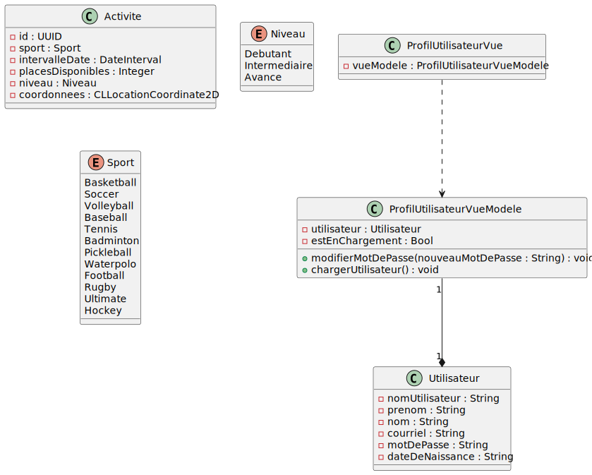

Le site web est accessible via https://michellamothe.github.io/SportLink/.

Le prototype Figma est accessible via [ce lien](https://www.figma.com/design/N0QDEh5Shuht6eS3dpvKTB/SportLink?node-id=0-1&t=CBkQlTjm84oNgfAk-1).

Pour visualiser le fichier `.puml` dans le répertoire `diagrams/`, vous devez avoir installé l'extension PlantUML dans VSCode et ensuite faire `Alt`+`D` sur Windows ou `Opt`+`D` sur macOS. Il est également conseiller d'installer Graphviz avec la commande `brew install graphviz`.

Arborescence approximative des dossiers :
```plaintext
SportLink/
├── App/
|   ├── SportLinkApp.swift
|   └── EtatApp.swift
|
├── Fonctionnalitees/
|   ├── Accueil/
|   |   ├── Vues/
|   |   ├── VuesModeles/
|   |   └── Sousvues/
│   ├── Activites/
|   |   ├── Vues/
|   |   ├── VuesModeles/
|   |   └── Sousvues/
│   ├── Explorer/
|   |   ├── Vues/
|   |   ├── VuesModeles/
|   |   └── Sousvues/
│   ├── Messagerie/
|   |   ├── Vues/
|   |   ├── VuesModeles/
|   |   └── Sousvues/
│   └── Profil/
|       ├── Vues/
|       ├── VuesModeles/
|       └── Sousvues/
|
├── ModelesPartagees/
|   ├── Utilisateur.swift
|   ├── Activite.swift
|   ├── Message.swift
|   └── Emplacement.swift
|
├── ComposantesUI/
|   ├── Boutons/
|   ├── Icones/
|   └── Cartes/
|
├── Services/
|   ├── Geolocalisation/
│   |   └── ServiceEmplacement.swift
|   ├── Authentification/
│   |   └── ServiceUtilisateur.swift
|   └── Reseau/
│       └── APIClient.swift
|
└── Ressources/
    └── Actifs/
```

Diagramme de classes : 

