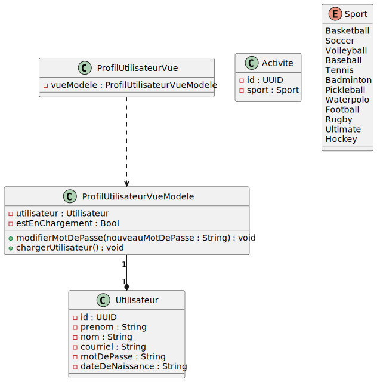
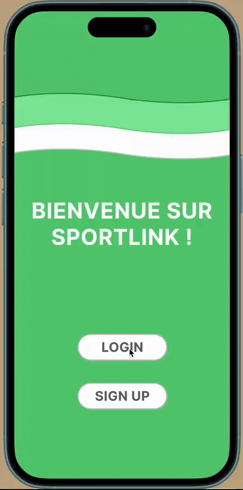
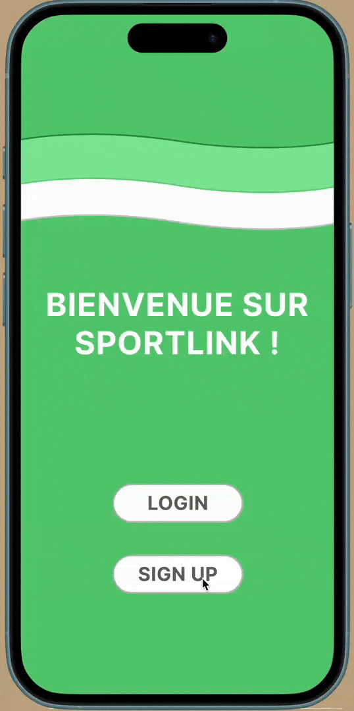

# Conception

## Architecture

- Décrire l'architecture du système proposé.

## Choix technologiques

- Justifier les technologies et outils choisis.

## Modèles et diagrammes
Nous avons décidé de ne pas mettre les sous vues dans le diagramme, car nous pensons qu'il deviendrait trop grossier avec toutes les classes qui n'ont pas nécessairement d'attributs ou de méthodes pertinentes.


## Modèle de données

### `utilisateurs`

```txt
utilisateurs
├── utilisateurId (doc ID)
    ├── nomUtilisateur : "mimi123"
    ├── courriel : "michel@example.com"
    ├── motDePasseHash : "hashed_pw"
    ├── photoProfil : "https://..."
    ├── disponibilites :
    │   ├── lundi : ["AM", "PM"]
    │   ├── mardi : ["AM"]
    │   └── ...
    ├── sportsFavoris : ["Soccer", "Tennis"]
    ├── mode : "récréatif" | "compétitif"
    ├── pointsParSport :
    │   ├── Soccer : 1200
    │   ├── Tennis : 800
    ├── niveauParSport :
    │   ├── Soccer : 3
    │   ├── Tennis : 2
    ├── evenementsOrganises : [eventId1, eventId2]
    ├── evenementsInscrits : [eventId3]
    ├── evenementsFavoris : [eventId4]
    ├── partenairesRecents : [
    │     {
    │       utilisateurId : "autreId",
    │       sport : "Soccer",
    │       activitesPartagees : 4,
    │       dernierResultat : "+10"
    │     }
    │   ]
```

### `evenements`

```txt
evenements
├── evenementId (doc ID)
    ├── organisateurId : "utilisateurId"
    ├── sport : "Basketball"
    ├── date : "2025-06-12"
    ├── heureDebut : "18:00"
    ├── heureFin : "20:00"
    ├── lieu :
    │   ├── nom : "Parc Jean-Drapeau"
    │   ├── latitude : 45.508
    │   ├── longitude : -73.554
    ├── niveau : 2
    ├── maxParticipants : 6
    ├── participants : [utilisateurId1, utilisateurId2]
    ├── statut : "ouvert" | "complet" | "annulé"
    ├── discussionId : "chat123"
```

### `discussions`

```txt
discussions
├── discussionId
    ├── evenementId : "eventId"
    ├── participants : [utilisateurId1, utilisateurId2]
    ├── messages : [
    │     {
    │       auteurId : "utilisateurId1",
    │       contenu : "Salut !",
    │       timestamp : "2025-05-31T12:10:00"
    │     }
    │   ]
```

### 🔎 Indexation recommandée

- ✅ **Filtre par sport** : `index sport`
- ✅ **Filtre par date** : `index date`
- ✅ **Filtre par niveau** (mode compétitif) : `index niveau`
- ✅ **Tri par distance** : via *geohash* ou librairie comme `geofirestore`

## Prototype
La maquette Figma se trouve [ici](https://www.figma.com/design/N0QDEh5Shuht6eS3dpvKTB/SportLink?node-id=0-1&t=CBkQlTjm84oNgfAk-1).





