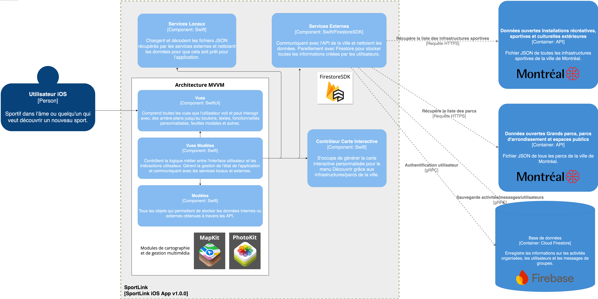

# Conception

## Architecture
```plaintext
SportLink/
├── AppEntry/
|
├── Authentication/
|
├── Core/
|   ├── Extensions/
|   ├── Models/
|   └── Services/
|       ├── Firebase/
|       └── Local/
|
├── Navigation/
|   ├── Home/
|   ├── Discover/
|   ├── Create/
|   ├── Bookings/
|   └── Profile/
|   
├── Resources/
|   ├── Assets/
|   ├── Configuration/
|   └── Data/
|
└── Shared/
```

## Choix technologiques
Nous avons opté pour un développement **natif iOS en Swift**, pour :

- Utilisation de `Xcode` comme IDE pour le code et la simulation en temps réelle

    - Tirer parti des composants natifs (localisation, notifications)

    - Cibler uniquement iOS 17+ pour simplifier les tests https://developer.apple.com/support/app-store/ [_Statistiques de répartition des versions iOS_]

- Utilisation du framework `SwiftUI` afin de bénéficier de la stabilité et des performances natives

- Utilisation de `Firebase` pour le backend, plus exactement `Cloud Firestore`

## Modèles et diagrammes
Voici notre diagramme UML :


## Architecture du système
Voici notre diagramme notre modèle C4 :


## Modèle de données
Voici le modèle de données style NoSQL qui réflète les *entités métiers*. C'est ainsi que les données seront stockées dans Firebase.

### `activites`
```txt
activites    (collection)
├── {activiteId}
    ├── organisateurId
    ├── titre
    ├── sport 
    ├── date
    ├── indraID
    ├── descritpion
    ├── nbJoueursRecherches : 6
    ├── statut : "ouvert" | "complet" | "annule"
    └── invitationsOuvertes
```
### `utilisateurs`
```txt
utilisateurs    (collection)
└── {utilisateurId}
    ├── nomUtilisateur               
    ├── photoUrl         
    ├── disponibilites        
    └── sportsFavoris                                                                  
```

### `messages`
```txt
messages    (collection)
└── {messageId}
    ├── auteurId : "utilisateurId1",
    ├── contenu : "Salut !",
    └── timestamp : "2025-05-31T12:10:00"
```

## Prototype
La maquette Figma se trouve [ici](https://www.figma.com/design/N0QDEh5Shuht6eS3dpvKTB/SportLink?node-id=0-1&t=CBkQlTjm84oNgfAk-1).