# Résultats

## Fonctionnalités

- *Authentification complète* : inscription avec nom, courriel, mot de passe, sports favoris, disponibilités et photo optionnelle ; connexion sécurisée ; gestion et mise à jour du profil via Firebase Authentication, Firestore et Storage.
- *Profil utilisateur* : affichage des informations personnelles, sports favoris, disponibilités hebdomadaires, photo de profil (téléchargée ou par défaut) et possibilité de déconnexion.
- *Carte interactive* : exploration des infrastructures sportives avec filtres par sport et date, marqueurs personnalisés, gestion multi-sports et zoom adaptatif.
- *Recherche et filtrage d’activités* : affichage sous forme de carte ou de liste, tri par date ou distance, exclusion des activités déjà organisées ou rejointes.
- *Création d’activités sportives* : formulaire structuré (titre, sport, lieu, date, horaires, participants, description, invitations), validation des champs, vérification des conflits horaires et enregistrement dans Firestore avec image d’aperçu de la carte.
- *Gestion des activités* : affichage et modification des activités organisées ; vue des activités auxquelles l’utilisateur participe ou qu’il a enregistrées.
- *Recommandations* : mise en avant d’activités suggérées à l’accueil, pouvant à terme s’adapter aux préférences sportives et disponibilités de l’utilisateur.
- *Données en temps réel* : synchronisation dynamique des activités et de la participation grâce à Firebase.
- *Accessibilité* : compatibilité avec VoiceOver et ajout de descriptions accessibles aux éléments interactifs.

## Démonstration

Voici notre vue de l’écran de démarrage (splash screen) :

Voici notre vue d’accueil — section du bas :
")

Voici notre vue d’accueil — section du haut :
")

Voici notre vue des détails d’activité — partie du bas :
")

Voici notre vue des détails d’activité — partie du haut :
")

Voici notre vue des activités organisées (Bookings — Hosting) :
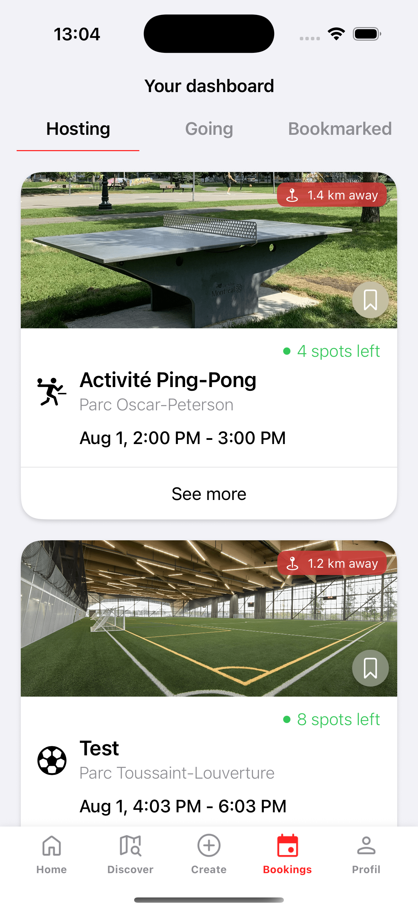

Voici notre vue de la carte avec filtres :
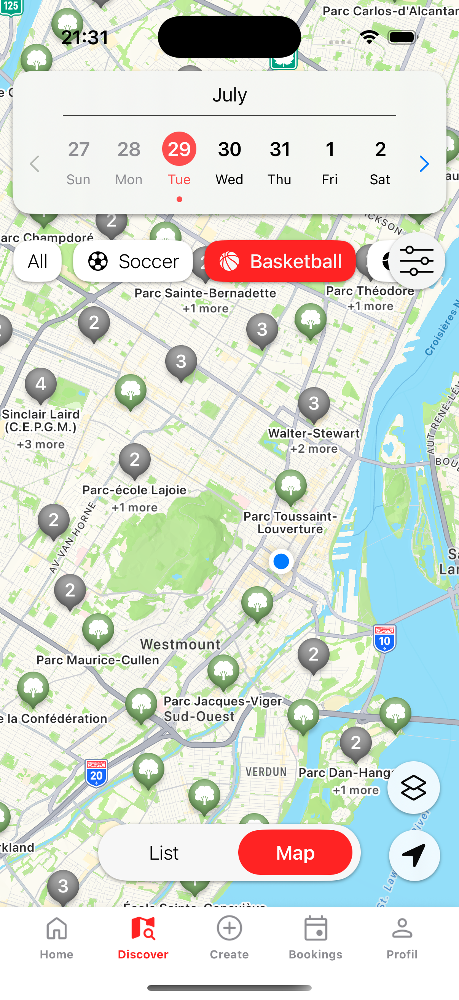

Voici notre vue de connexion :
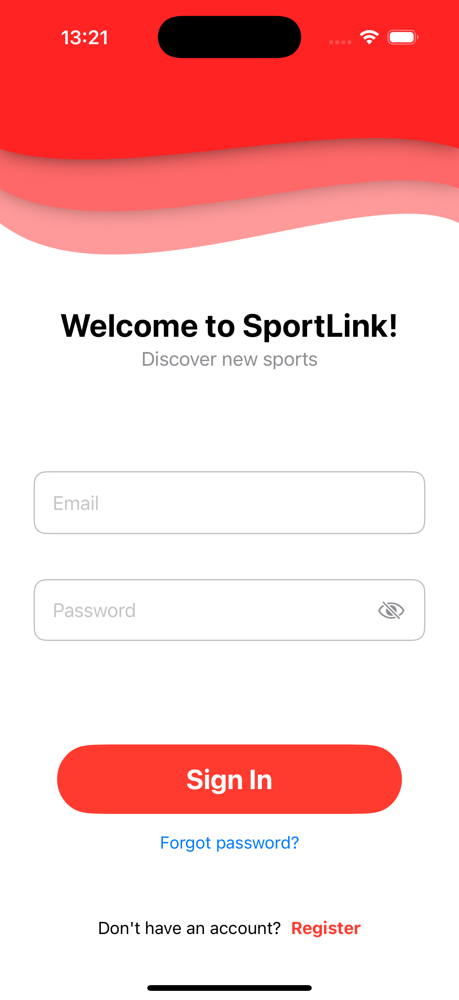

Voici notre vue de création d’activité — partie du bas :
")

Voici notre vue de création d’activité — partie du haut :
")

Voici notre vue du panneau de filtres d’activités :
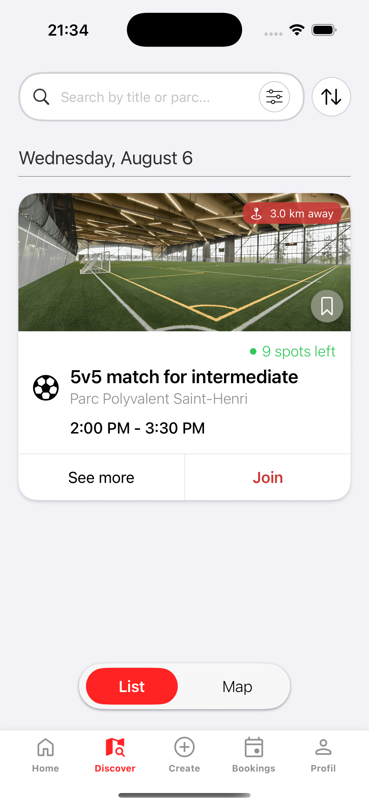

Voici notre vue d’inscription — disponibilités :
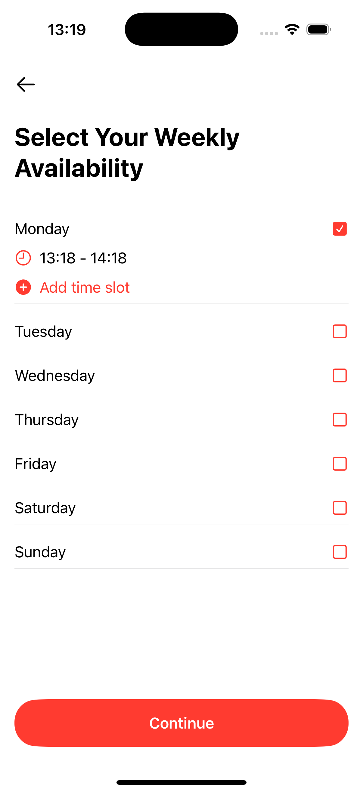

Voici notre vue d’inscription — ajout de photo de profil :
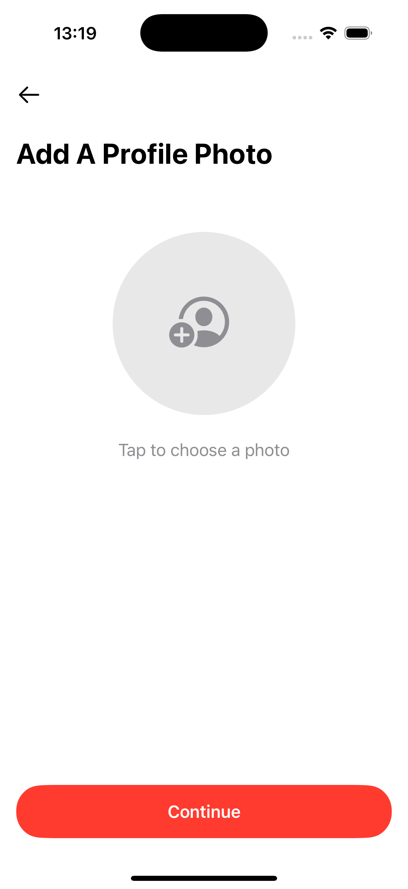

Voici notre vue d’inscription — choix des sports :
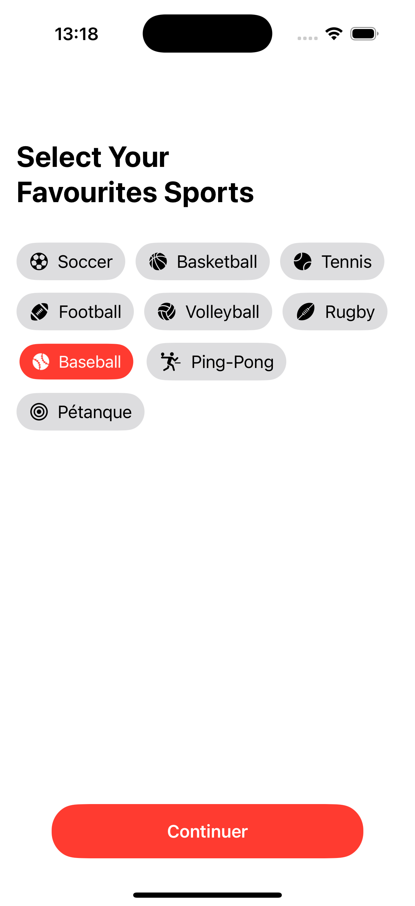

Voici notre vue d’inscription (formulaire principal) :
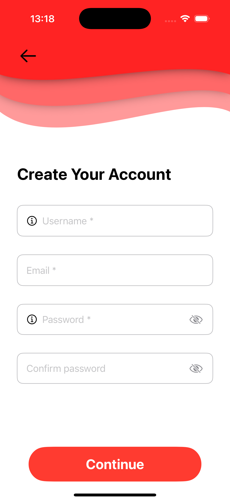

Voici notre vue de la liste avec filtres :
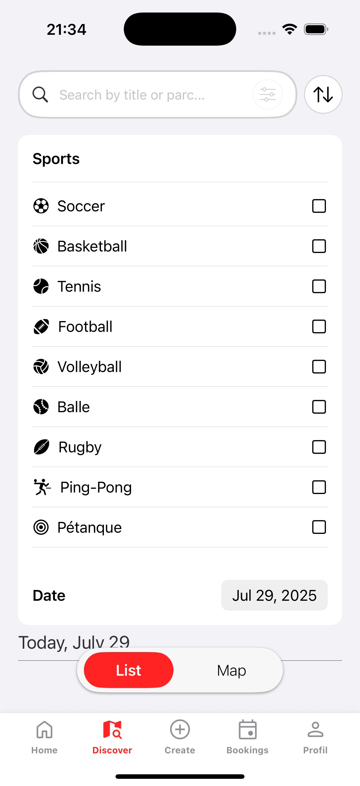

Voici notre vue de modification d’une activité :
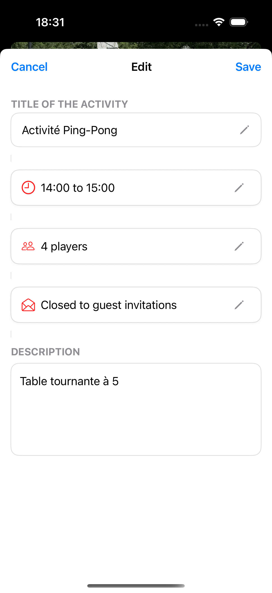

Voici notre vue de profil :
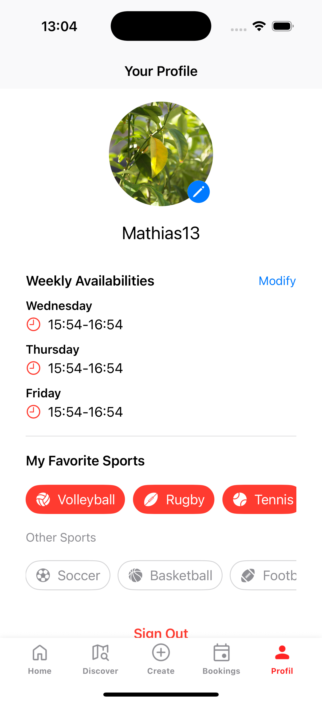

## Bilan

- Évaluer la réalisation des objectifs initiaux.
